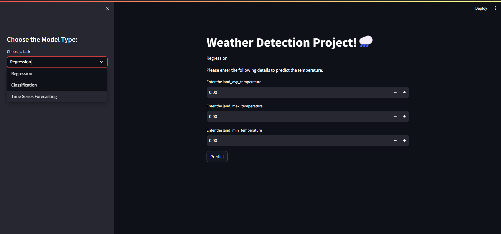
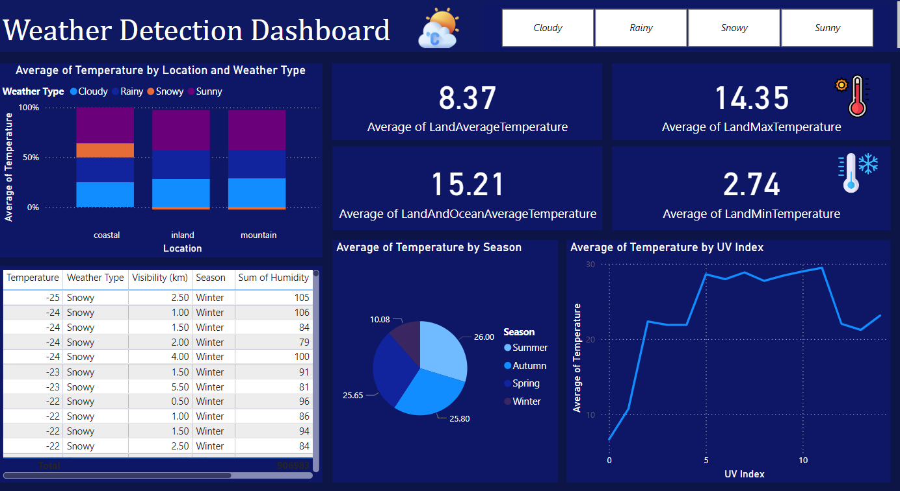

# Weather-Detection-Project🌥️
### Project Tools 🛠️:
- Data Analysis Techniques
- Explotary Data Analysis
- Data Preprocessing
- Machine Learning Algorithms
- Time Series Analysis & Forecasting
- Web Deployment using Streamlit
- Build an Interactive Dashboard

## This project aims to predict the weather using various data science and machine learning techniques. We employed classification, regression, and time series forecasting methods to predict weather temperatures accurately.

# Dataset📊

The datasets we used contains Two tables: one for Regression and Forcasting tasks, and one for Classification tasks.

To access the Classification dataset click [HERE](https://github.com/sahermuhamed1/Weather-Detection/blob/main/weather_classification_data.csv)
To access the Regression and Forcasting dataset click [HERE](https://github.com/sahermuhamed1/Weather-Detection/blob/main/GlobalTemperatures.csv)

# ML Models🧠

We  tried Several machine learning models evaluate them for  weather detection, but we  consider only random forest algorithm for both classification and regression tasks

to access the classification notebook click [HERE](https://github.com/sahermuhamed1/Weather-Detection/blob/main/weather_classification%5B1%5D.ipynb)
to access the forcasting and regression notebook click [HERE](https://github.com/sahermuhamed1/Weather-Detection/blob/main/Weather%20forcasting.ipynb)

The performance of each model is evaluated using metrics such as accuracy and confusion matrix for classification and Mean Squared Error (MSE) and R2 score for regression tasks.

# Time Series Forcasting 📉

Steps:

1. **Prepare Data for Prophet**:
   - Prepare the data by resetting the index of the DataFrame and renaming the relevant columns to fit Prophet’s expected format. Rename the 'Date' column to 'ds' and the 'land_and_ocean_AVG' column to 'y'.
     
2.  **Initialize and Fit the Model**
   - nitialize the Prophet model and fit it using the prepared DataFrame. This step involves training the model to understand the historical data and capture the seasonality and trends.

4. **Create a Future DataFrame for Prediction**
   - Create a future DataFrame that extends the time range of the data by 12 months to generate future predictions. Set the frequency to monthly ('M').

5. **Plot the Forecast**
   - Plot the forecast to visualize the predicted values along with historical data, providing insights into future trends.

6. **Predict Temperature for a Specific Date**
   - Define a function predict_temperature that takes a date string as input, converts it to a datetime object, and creates a DataFrame for that date.
   - Use the trained model to predict the temperature for the specified future date, returning the predicted value along with the confidence intervals.

# Deployment 🛠️

In this project, we utilize Streamlit as our deployment tool to transform our AI model into an interactive dashboard. This platform enables users to input text, triggering our AI model's and algorithms, tp providing an prediction for the weather tempreture.

to access the application [Link](link)

# Dashboard 📊

in the end of our data science project we utilise power BI to visualize the datasets we use in the project to get some insights from the dataset that can help the client to be familiar with his own data.

# Usage🤔

To use this weather detection project:

1. Load the classification dataset from [HERE](https://github.com/sahermuhamed1/Weather-Detection/blob/main/weather_classification_data.csv)
2. Load the Regression and Forecasting dataset from [HERE](https://github.com/sahermuhamed1/Weather-Detection/blob/main/GlobalTemperatures.csv)
3. Project Presentation [HERE](https://github.com/sahermuhamed1/Weather-Detection/blob/main/Weather%20detection%20presentation.pptx)
4. Access the classification notebook from [HERE](https://github.com/sahermuhamed1/Weather-Detection/blob/main/weather_classification%5B1%5D.ipynb)
5. Access the regression and forecasting notebook from [HERE](https://github.com/sahermuhamed1/Weather-Detection/blob/main/Weather%20forcasting.ipynb)
6. Web application file [HERE](https://github.com/sahermuhamed1/Weather-Detection/blob/main/App.py)
7. Power BI dashbaord from [HERE](https://github.com/sahermuhamed1/Weather-Detection/blob/main/Weather%20Dashboard.pbix)

# Contact info📩
For inquiries or further collaboration, please contact Saher Mohammed at [sahermuhamed176@gmail.com].🥰

[Saher's Linkdin](https://www.linkedin.com/in/sahermuhamed/)

